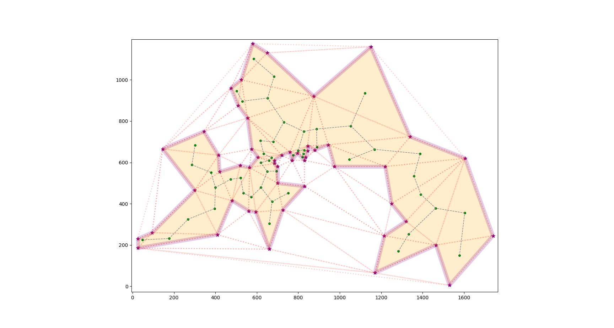

# Surface-Based TSP (MiniZinc Models)

This repository contains MiniZinc models for the planar simplification of the surface-based Traveling Salesman Problem (TSP) formulation described in:

Yılmaz Arslanoğlu.  
*"A Surface-Based Formulation of the Traveling Salesman Problem."* arXiv preprint arXiv:2603.00075, 2026.

https://arxiv.org/abs/2603.00075

The paper is a preprint of work to be presented at the 42nd European Workshop on Computational Geometry (EuroCG 2026), held March 25–27, 2026 in Hagen, Germany.

---

## Idea

Classical TSP formulations construct a Hamiltonian cycle of edges.

In the surface-based formulation, we instead select a connected set of triangles forming a surface, where the boundary of the surface is the tour.

Instead of directly enforcing Hamiltonicity on the graph, the formulation enforces topological constraints on a two-dimensional complex, including:

- global connectivity
- manifold constraints
- local Euler-characteristic constraints

The resulting boundary corresponds to the TSP tour.

---

## What is implemented here

The full theoretical model uses a bipartite incidence structure between triangles and edges.

For planar triangulations, this structure simplifies significantly.  
The models in this repository implement this planar simplification in MiniZinc.

Two main models are provided:

- `dual_surface_tsp_mip.mzn`  
  A version optimized for MILP solvers.

- `dual_surface_tsp_cp.mzn`  
  A version intended for CP solvers.

The repository also contains both floating-point and integer variants for the Single-Commodity Flow-based implementation of the global tree connectivity constraint.  
Some CP solvers require integer arithmetic, so the floating-point implementation may need to be replaced with the integer version by switching the relevant include file.

MIP solvers support both integer and floating-point versions. The MIP-oriented model therefore keeps the floating-point formulation, as it may lead to better performance in some solvers.

The implementation is intended to form a base for experimentation with the modeling approach described in the paper.

---

## Data files

The `.dzn` files in `data/` are **preprocessed instances** designed for efficient use within MiniZinc.

To match MiniZinc's indexing and array structure, the input data is provided in a flattened representation (for example flattened triangle–edge incidence arrays). This avoids costly preprocessing inside the model and improves solver performance.

The instances correspond to **triangulated candidate sets**. Because the optimization is restricted to edges induced by these triangulations, the resulting tours are **not guaranteed to be globally optimal TSP tours** in general.

Pre-rendered output visualizations for several instances are available in the `output_images/` folder.

Some instance files in `data/` are derived from public benchmark sources such as TSPLIB benchmark instances and other published TSP instance collections.

These files contain preprocessing and transformation specific to this repository.
MIT licensing applies to the transformation logic and file structure only.
Underlying benchmark data remain attributable to their original sources.

---

## Repository structure

```
data/
    Preprocessed MiniZinc instance files

output_images/
    Pre-generated visualizations of solutions

dual_surface_tsp_mip.mzn
    Main MILP-optimized model

dual_surface_tsp_cp.mzn
    Main CP-optimized model

variables.mzn
    Decision variables

objective.mzn
    Objective function

instance_utilities.mzn
    Shared instance utilities

global_connectivity/
    Connectivity constraints enforcing a single tree

local_connectivity/
    Local topological / Euler constraints

tree_implementation/
    Alternative custom tree / connectivity encodings
```

---

## Requirements

- MiniZinc

Any compatible solver supported by MiniZinc, for example:

MIP solvers

- HiGHS
- CBC

CP solvers

- Chuffed
- Gecode

---

## Running the model

Example using a MIP solver:

```bash
minizinc dual_surface_tsp_mip.mzn data/berlin52.dzn --solver highs --intermediate-solutions
```

Example using a CP solver:

```bash
minizinc dual_surface_tsp_cp.mzn data/burma14.dzn --solver chuffed --intermediate-solutions
```

The models can also be executed from the MiniZinc IDE.

---

## Model variants

The repository allows experimenting with different modeling choices.

Examples include:

- Replacing the custom flow-based tree implementation with MiniZinc's native tree constraint.

- Running the model with CP solvers instead of MIP solvers.  
  Some CP solvers require integer arithmetic; in that case the floating-point implementation should be replaced with the integer version by switching the relevant include file, if the custom tree implementation is to be used.

- Selecting alternative local connectivity encodings from

```
local_connectivity/
```

---

## What the model enforces

The selected triangles must satisfy structural constraints so that they form a valid surface:

- triangle–edge incidence consistency
- manifold edge constraints
- global connectivity as a single rooted tree
- local Euler-type constraints at vertices (TSP cities)

The objective minimizes the length of the induced boundary, which corresponds to the TSP tour.

---

## Scope

This repository provides a MiniZinc implementation of the planar surface-based TSP model intended for experimentation and exploration.

---

## Citation

If you use this code, please cite:

```bibtex
@article{arslanoglu2026surface,
  title={A Surface-Based Formulation of the Traveling Salesman Problem},
  author={Arslanoğlu, Yılmaz},
  year={2026},
  journal={arXiv preprint arXiv:2603.00075},
  doi={10.48550/arXiv.2603.00075},
  url={https://arxiv.org/abs/2603.00075}
}
```

---

## Conference

42nd European Workshop on Computational Geometry (EuroCG 2026)  
FernUniversität in Hagen  
Hagen, Germany  
March 25–27, 2026
